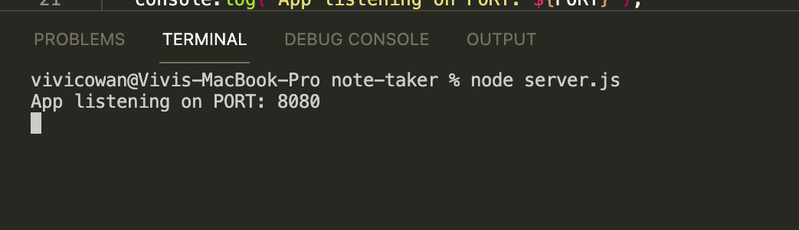
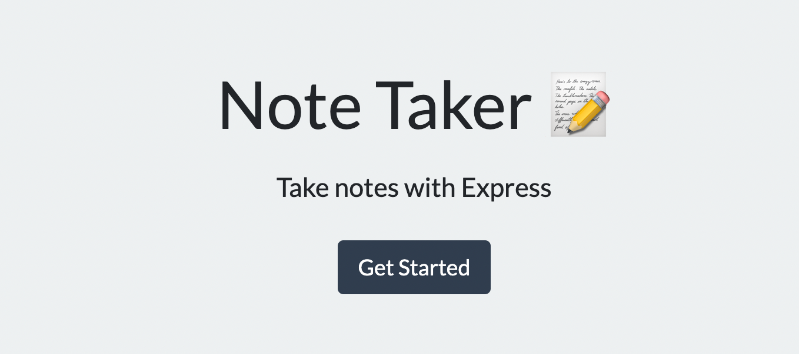
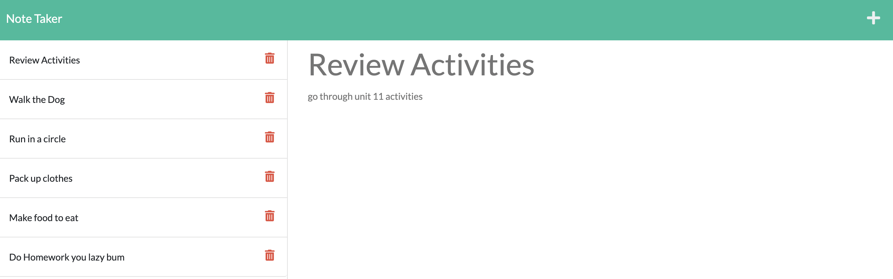

# Note-Taker

## Description:
- For this task, I wanted to be able to write, save, and delete notes on a server that is fully functional.  
- The reason I built this note taker was to use what I have learned with Express JS and create a server with successful routing. I also got to explore the use of Insomnia to test my server before it was deployed.
- This task helped me gain addition experience and practice with servers. Learning Express JS was surprisingly straight forward and was very easy to use.  
- This note taker allowed me to realize the usefulness of insomnia when testing out a server.

## Deployed Link
- Heroku: https://note-taker-3005.herokuapp.com/
- GitHub Repository: https://github.com/vivicowan/note-taker

## Mock-Up
Command Line:

The deployed page:

